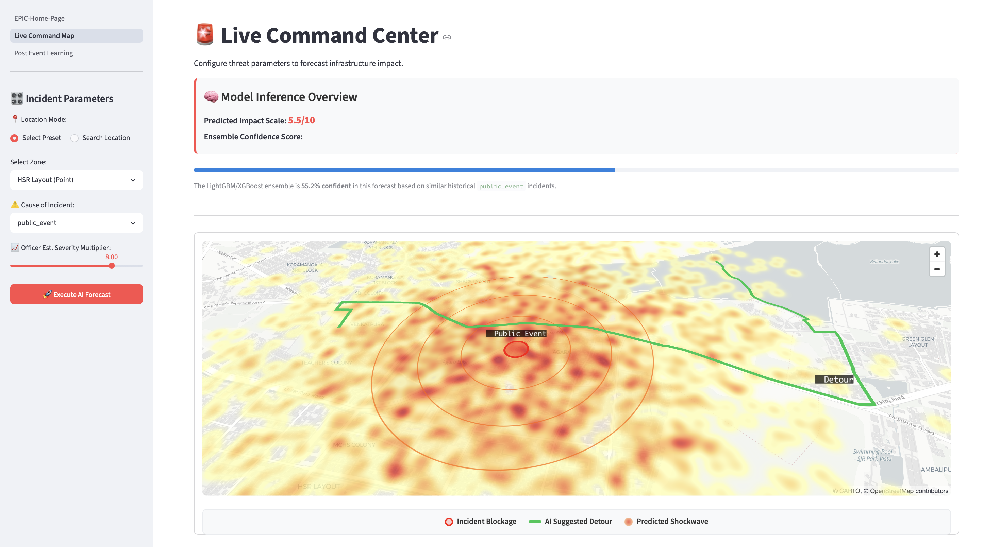
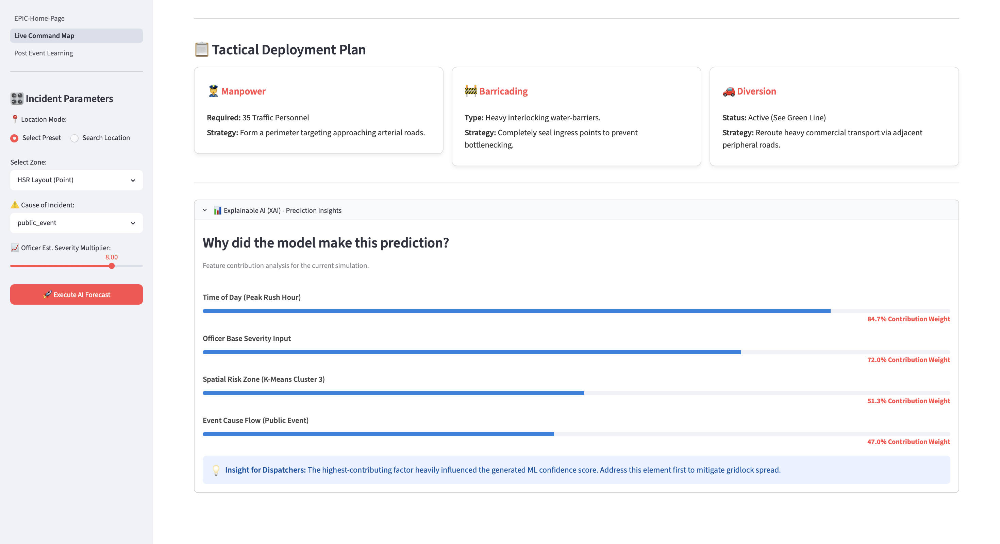

<div align="center">
  
  
  <h1>🚨 E.P.I.C.: Event Predictive Impact & Congestion Engine</h1>
  <p><b>An interactive, real-time AI traffic forecasting and tactical auto-dispatch dashboard.</b></p>

  <!-- Live Demo Badge -->
  <a href="https://epic-event-predictive-impact-congestion-engine.streamlit.app/">
    
  </a>
  <br><br>
  <!-- Badges -->
  
  
  
  
  
</div>

---

## 🌟 Overview

The **E.P.I.C. Dashboard** is a powerful urban mobility tool designed to help traffic dispatchers and city planners transition from reactive incident management to proactive, mathematical resource deployment. 

By leveraging a robust Machine Learning ensemble (LightGBM + XGBoost) for spatial traffic predictions, `PyDeck` for stunning interactive 3D visualizations, and the `OSRM` API for real-time detour routing, this application provides a comprehensive command suite for mitigating urban gridlock before it happens.

---

## 🚀 Core Features

This application is split into two primary modules designed to give you a complete picture of urban traffic management:

### Part 1: Live Command Center (The Map & Simulator)
This module simulates real-world incidents and generates automated tactical plans.
- **Predictive Shockwaves:** Generates interactive "X-Ray" heatmaps and concentric radar rings to visualize gridlock spillover into surrounding arterial roads.
- **Automated Detour Routing:** Pings the OSRM routing API to dynamically draw high-visibility, smart bypass routes around predicted hazard zones.
- **Tactical Auto-Dispatch:** Translates complex AI probabilities into plain-English directives detailing exact manpower requirements and barricading strategies.
- **Explainable AI (XAI):** An interactive insights panel dynamically breaks down the exact features (e.g., peak hours, spatial clusters) that triggered the AI's severity score.

### Part 2: Post-Event Learning (The Ledger)
This module creates a closed-loop system so the AI gets smarter over time.
- **Cloud Synchronization:** Officers can commit live operational logs directly to a secure **Supabase** cloud database with a single click.
- **Historical Ledger:** Displays recent events actively training the AI model, showcasing the system's continuous feedback and accuracy loop.

---

## 📸 App Screenshots

### 1. Live Command Map & X-Ray Heatmap
> Visualizing a predictive congestion shockwave with automated AI detour routing.


### 2. Tactical Dispatch & Explainable AI
> Plain-English officer dispatch recommendations and feature contribution charts.


---

## 📁 Repository Structure

```text
.
├── LICENSE                      # License information
├── README.md                    # Project documentation
├── app/
│   ├── EPIC-Home-Page.py        # 🚀 Main application entry point
│   └── pages/
│       ├── 1_Live_Command_Map.py    # Map visualization, ML inference, and OSRM
│       └── 2_Post_Event_Learning.py # Supabase cloud logging ledger
├── ml_core/
│   ├── Data_and_feature_engineering.ipynb # Model training & data pipeline
│   ├── Flipkart_Dataset.csv               # Base training dataset
│   ├── epic_model_tuned.pkl               # Trained LightGBM/XGBoost ensemble
│   ├── model_features.pkl                 # Encoded feature mapping array
│   └── spatial_cluster_model.pkl          # K-Means geographic clustering model
└── requirements.txt             # Python package dependencies
```

---

## 🛠️ Installation & Setup

Follow these steps to get the app running on your local machine.

### 1. Clone the Repository
```bash
git clone [https://github.com/your-username/EPIC-Event-Predictive-Impact-Congestion-Engine.git](https://github.com/your-username/EPIC-Event-Predictive-Impact-Congestion-Engine.git)
cd EPIC-Event-Predictive-Impact-Congestion-Engine
```

### 2. Create a Virtual Environment (Recommended)
```bash
python -m venv epic
source epic/bin/activate  # On Windows use: epic\Scripts\activate
```

### 3. Install Dependencies
```bash
pip install -r requirements.txt
```

### 4. Configure Cloud Secrets (Optional)
To test the "Post-Event Learning" cloud sync feature:
```bash
mkdir .streamlit
touch .streamlit/secrets.toml
# Add SUPABASE_URL and SUPABASE_KEY to this file
```

### 5. Run the Streamlit App
```bash
streamlit run app/EPIC-Home-Page.py
```

The application will automatically open in your default web browser at `http://localhost:8501`.

---

## 🤝 Contributing

Contributions, issues, and feature requests are welcome! 

1. Fork the Project
2. Create your Feature Branch (`git checkout -b feature/AmazingFeature`)
3. Commit your Changes (`git commit -m 'Add some AmazingFeature'`)
4. Push to the Branch (`git push origin feature/AmazingFeature`)
5. Open a Pull Request

---

## 📝 License

Distributed under the MIT License. See `LICENSE` for more information.

---
<p align="center">Developed with ❤️ for Smart Cities & Urban Mobility.</p>